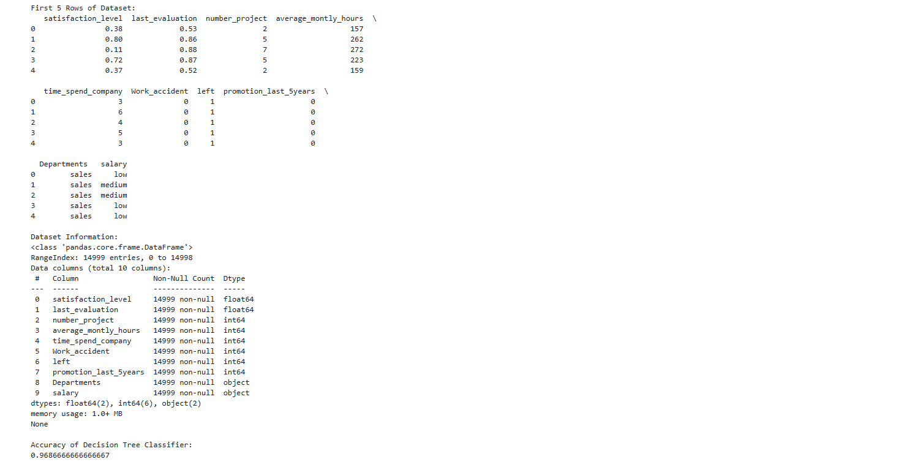
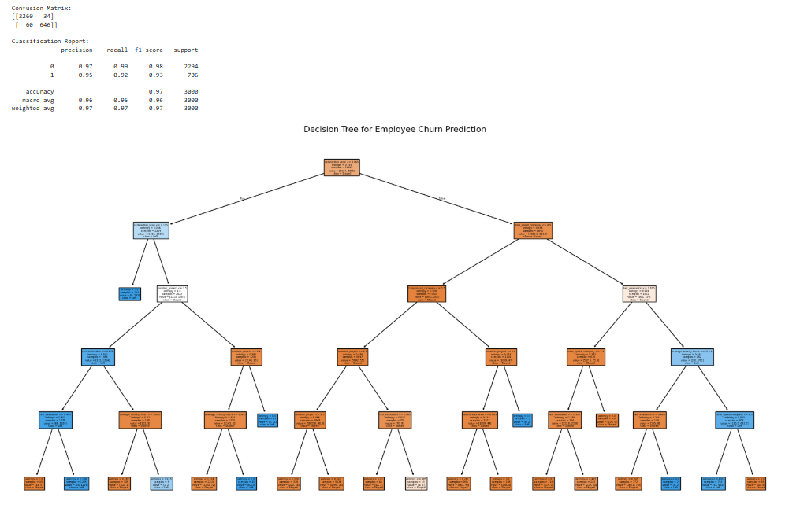

# Implementation-of-Decision-Tree-Classifier-Model-for-Predicting-Employee-Churn

## AIM:
To write a program to implement the Decision Tree Classifier Model for Predicting Employee Churn.

## Equipments Required:
1. Hardware – PCs
2. Anaconda – Python 3.7 Installation / Jupyter notebook

## Algorithm
1. Collect and Prepare the Dataset
2. Split the Data
3. Train the Decision Tree Classifier
4. Predict and Evaluate the Model

## Program:

/*
Program to implement the Decision Tree Classifier Model for Predicting Employee Churn.
Developed by: SABEEHA PARVEEN K
RegisterNumber: 212225230233
*/
```
#import required libraries
import pandas as pd
from sklearn.model_selection import train_test_split
from sklearn.preprocessing import LabelEncoder
from sklearn.tree import DecisionTreeClassifier
from sklearn.metrics import accuracy_score, classification_report, confusion_matrix
from sklearn import tree
import matplotlib.pyplot as plt

# Load dataset
data = pd.read_csv("Employee.csv")

# Display first 5 rows
print("First 5 Rows of Dataset:")
print(data.head())

# Display dataset information
print("\nDataset Information:")
print(data.info())

# Convert categorical columns into numerical values
label_encoder = LabelEncoder()

for column in data.columns:
    if data[column].dtype == 'object':
        data[column] = label_encoder.fit_transform(data[column])

# Define features and target variable
# 'left' is the target column (Employee Churn)
X = data.drop("left", axis=1)
y = data["left"]

# Split dataset into training and testing sets
X_train, X_test, y_train, y_test = train_test_split(
    X,
    y,
    test_size=0.2,
    random_state=42
)

# Create Decision Tree Classifier model
model = DecisionTreeClassifier(
    criterion='entropy',   # You can also use 'gini'
    max_depth=5,
    random_state=42
)

# Train the model
model.fit(X_train, y_train)

# Predict using test data
y_pred = model.predict(X_test)

# Calculate accuracy
accuracy = accuracy_score(y_test, y_pred)

print("\nAccuracy of Decision Tree Classifier:")
print(accuracy)

# Display confusion matrix
print("\nConfusion Matrix:")
print(confusion_matrix(y_test, y_pred))

# Display classification report
print("\nClassification Report:")
print(classification_report(y_test, y_pred))

# Plot Decision Tree
plt.figure(figsize=(20,10))

tree.plot_tree(
    model,
    feature_names=X.columns,
    class_names=["Stayed", "Left"],
    filled=True
)

plt.title("Decision Tree for Employee Churn Prediction")
plt.show()

```

## Output:






## Result:
Thus the program to implement the  Decision Tree Classifier Model for Predicting Employee Churn is written and verified using python programming.
